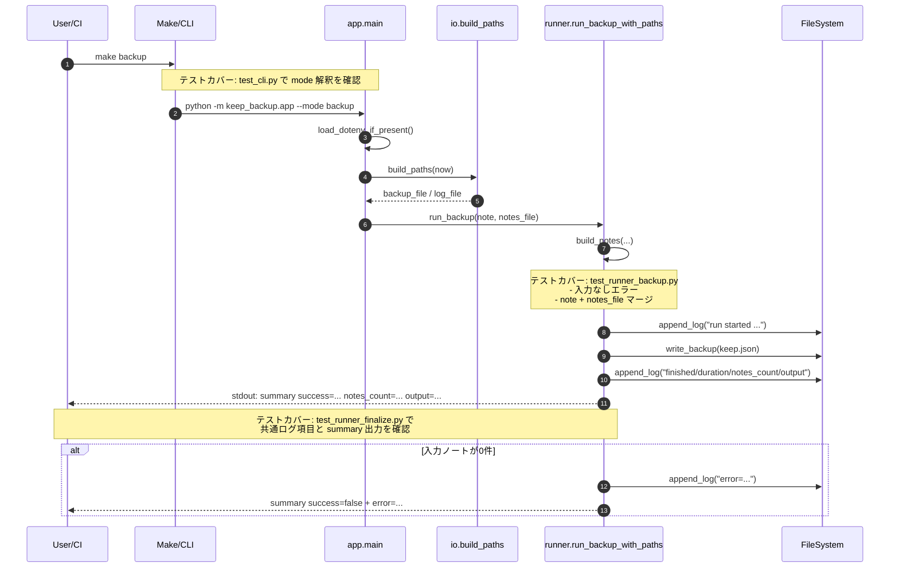

# 01-sequence — 代表ユースケースのシーケンス図（backupモード）

- 入口: `make backup` → `uv run python -m keep_backup.app --mode backup`（または `python -m keep_backup.app` の既定モード）。
- 出口: `backups/YYYY-MM-DD/keep.json` と `logs/run_YYYY-MM-DD_HHMMSS.log` を生成し、stdout に `summary ...` を出力。
- 主要関数: `keep_backup.app.main` → `keep_backup.runner.run_backup` → `keep_backup.runner.run_backup_with_paths` → `keep_backup.io.write_backup` / `keep_backup.runner._finalize_run`。
- テストコマンド: `uv run python -m unittest`。
- CIコマンド（関連）:
  - PRスモーク: `uv run python -m keep_backup.app --mode smoke-playwright-fixture`
  - バックアップCI: `python -m keep_backup.app --note "ci-smoke-note"`

## 要確認メモ
- README には将来の「ログイン済みプロファイルでの実Keep取得」方針があるが、現状の backup モードは手入力/ファイル入力ノートを JSON 化する薄い縦切り実装。実Keep全件取得のフローは未実装（要確認）。
