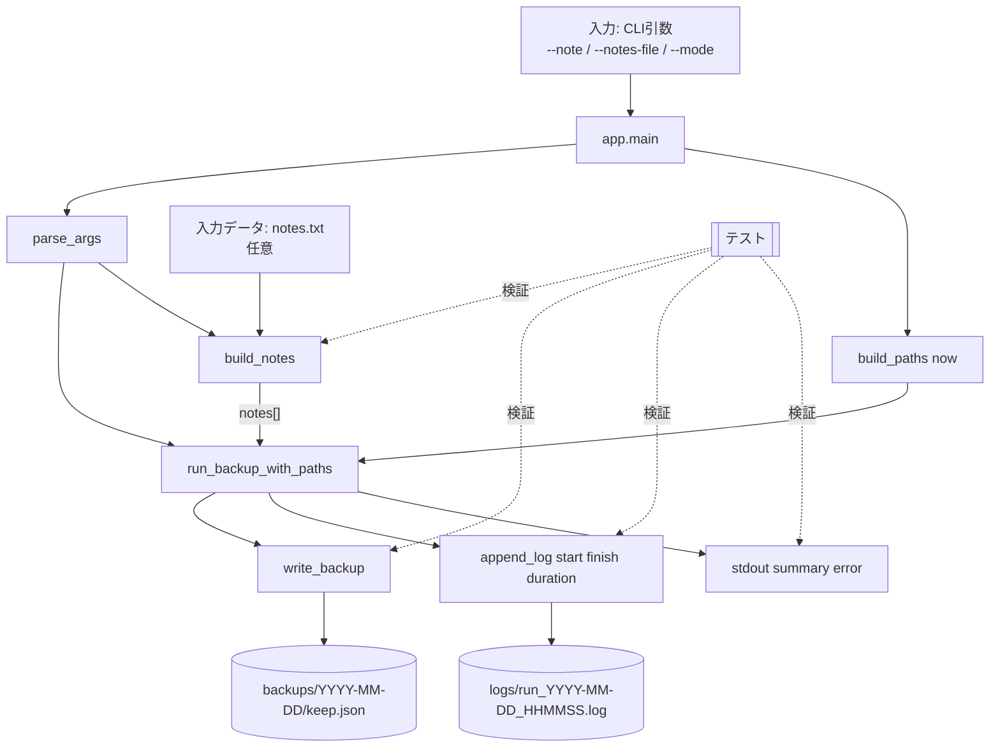

# 02-dfd — 代表ユースケースのデータフロー図（backupモード）

- 入口: `make backup` / `python -m keep_backup.app --mode backup`。
- 出口: `backups/YYYY-MM-DD/keep.json`、`logs/run_YYYY-MM-DD_HHMMSS.log`、stdout `summary`/`error`。
- 主要関数: `parse_args`、`build_notes`、`write_backup`、`_finalize_run`。
- テストコマンド: `uv run python -m unittest`。
- 詳細版（型/定義場所/責務/具体値つき）: `docs/diagrams/02-dfd-detailed.mmd`。
- CIコマンド（関連）: `python -m keep_backup.app --note "ci-smoke-note"`（`backup-ci.yml`）。

## テスト重ね合わせ（要点）
- `tests/test_runner_backup.py`
  - `build_notes` の空入力エラー。
  - `run_backup_with_paths` の成功時: `keep.json` と `log` 生成、`summary success=true`。
  - 失敗時: `summary success=false` と `error=...`。
- `tests/test_runner_finalize.py`
  - `_finalize_run` が共通ログ項目（duration/notes_count/output）を出力。

## 要確認メモ
- 実際の Keep UI からのノート抽出データフローは `smoke-playwright` では「ページ到達確認」が主で、backup モードに接続されていない（要確認）。
