# 03-ci — CIフロー図（.github/workflows 抽出）

- 入口:
  - PR: `.github/workflows/no-profile-smoke-pr.yml`
  - push/main・手動: `.github/workflows/backup-ci.yml`
  - 手動: `.github/workflows/secrets-notify-check.yml`
- 出口:
  - smoke結果判定（`summary success=true` 必須）
  - 必要時ログartifactアップロード
  - 通知メール送信（設定時）
- 主要関数/実行コマンド:
  - `uv lock --check` / `uv sync --locked`
  - `uv run python -m keep_backup.app --mode smoke-playwright-fixture`
  - `python -m keep_backup.app --note "ci-smoke-note"`
- テストコマンド（ローカル再現）: `uv run python -m unittest` + 各workflowと同等コマンド。
- CIコマンド: 下図ノード参照。

```mermaid
flowchart TD
    PR[PR to main] --> WF1[no-profile-smoke-pr.yml]
    PUSH[push to main / workflow_dispatch] --> WF2[backup-ci.yml]
    MANUAL[workflow_dispatch] --> WF3[secrets-notify-check.yml]

    subgraph WF1 [PR Smoke Workflow]
      A1[checkout + setup python/uv]
      A2[uv lock --check]
      A3[uv sync --locked]
      A4[uv run playwright install --with-deps chromium]
      A5[uv run python -m keep_backup.app --mode smoke-playwright-fixture]
      A6[stdoutから summary/error を検証]
      A7{failure?}
      A8[logs/run_*.log を artifact upload]
      A1-->A2-->A3-->A4-->A5-->A6-->A7
      A7--yes-->A8
    end

    subgraph WF2 [Backup CI Workflow]
      B1[checkout + setup python]
      B2[pip install -e .]
      B3[python -m keep_backup.app --note ci-smoke-note]
      B4[stdout解析して GITHUB_OUTPUT へ保存]
      B5[always: send mail]
      B1-->B2-->B3-->B4-->B5
    end

    subgraph WF3 [Notify Secrets Check]
      C1[必須Secretsの存在/形式チェック]
      C2[SMTP認証テスト]
      C3[成功時: テスト通知メール送信]
      C1-->C2-->C3
    end
```

## 要確認メモ
- `backup-ci.yml` は `pip install -e .` を使用し、PRスモーク系は `uv` 系コマンドを使用している。実行入口の統一方針との最終整合は要確認。
